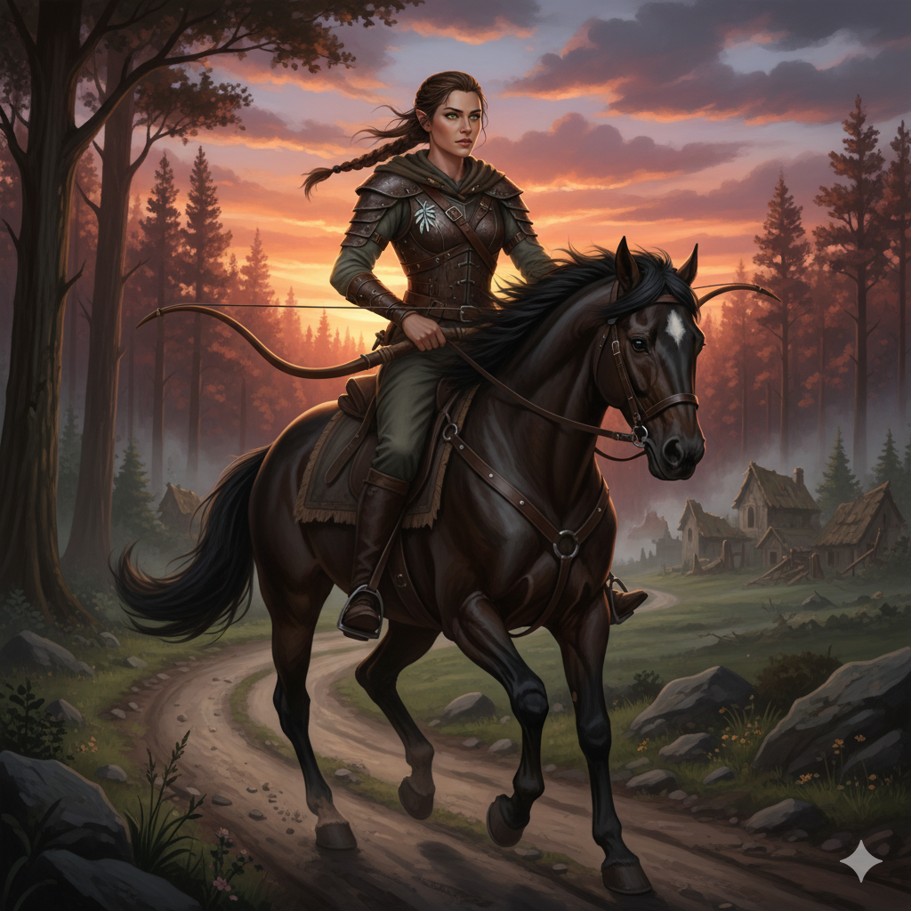

# Thalia Windrunner - Ficha de Personagem

## 📋 Informações Básicas

* **Nome Completo:** Thalia Windrunner
* **Raça:** Meio-Elfa
* **Classe e Nível:** Patrulheira (Nível 3)
* **Arquétipo:** Andarilha do Horizonte
* **Histórico:** Forasteira
* **Alinhamento:** Leal e Neutro
* **Inspiração:** \[ ]

---

## ❤️ Pontos de Vida e Defesa

* **Pontos de Vida Atuais:** 28 / **Máximos:** 28 (3d10)
* **Classe de Armadura:** 16 (Couro Batido + Mod. Destreza)
* **Iniciativa:** +3
* **Deslocamento:** 9 metros
* **Resistências/Imunidades:** Vantagem em salvaguardas contra ser encantado e imune a sono mágico.

---

## 📊 Atributos e Salvaguardas

| Atributo | Valor | Modificador | Salvaguarda |
| :--- | :---: | :---: | :---: |
| Força | 8 | -1 | +1 |
| Destreza | 17 | +3 | +5 |
| Constituição| 14 | +2 | +2 |
| Inteligência| 10 | +0 | +0 |
| Sabedoria | 15 | +2 | +2 |
| Carisma | 12 | +1 | +1 |

---

## 📜 Perícias, Ferramentas e Idiomas

### Perícias
*(P = Proficiente)*

| Status | Perícia | Mod. | Atributo |
| :---: | :--- | :---: | :---: |
| \[ ] | Acrobacia | **+3** | (Des) |
| \[ ] | Adestrar Animais | **+2** | (Sab) |
| \[ ] | Arcanismo | **+0** | (Int) |
| \[P] | Atletismo | **+1** | (For) |
| \[ ] | Atuação | **+1** | (Car) |
| \[ ] | Enganação | **+1** | (Car) |
| \[P] | Furtividade | **+5** | (Des) |
| \[ ] | História | **+0** | (Int) |
| \[ ] | Intimidação | **+1** | (Car) |
| \[P] | Intuição | **+4** | (Sab) |
| \[ ] | Investigação | **+0** | (Int) |
| \[ ] | Medicina | **+2** | (Sab) |
| \[ ] | Natureza | **+0** | (Int) |
| \[P] | Percepção | **+4** | (Sab) |
| \[ ] | Persuasão | **+1** | (Car) |
| \[ ] | Prestidigitação | **+3** | (Des) |
| \[ ] | Religião | **+0** | (Int) |
| \[P] | Sobrevivência | **+4** | (Sab) |

### Ferramentas e Idiomas
* **Idiomas:** Comum, Élfico, Silvestre
* **Ferramentas:** Proficiência com um tipo de instrumento musical (Flauta).

---

## ✨ Habilidades e Características

* **Herança Feérica:** Vantagem em salvaguardas contra ser encantado e não pode ser colocada para dormir por magia.
* **Versatilidade em Perícia:** Proficiência em duas perícias à sua escolha (usado para Furtividade e Intuição).
* **Inimigo Favorito:** Vantagem em testes de Sabedoria (Sobrevivência) para rastrear Humanos e Orcs, bem como em testes de Inteligência para recordar informações sobre eles.
* **Explorador Natural:** Perita em terrenos de Floresta. Enquanto viaja por uma hora ou mais em seu terreno favorito, obtém benefícios como terreno difícil não atrasar a viagem do grupo e não poder se perder exceto por meios mágicos.
* **Estilo de Luta (Arquearia):** Você ganha +2 de bônus nas jogadas de ataque com armas de ataque à distância.
* **Consciência Primitiva:** Pode usar sua ação e gastar um espaço de magia de patrulheiro para focar sua consciência nos arredores, detectando a presença de certos tipos de criaturas em um raio de 1,6 km.
* **Detectar Portal:** Pode usar uma ação para detectar a distância e a direção do portal planar mais próximo a até 1,6 km de você.
* **Golpe Planar:** Como uma ação bônus, pode gastar um espaço de magia para imbuir suas armas com energia planar. Por 1 minuto, uma vez por turno, ao acertar uma criatura, você pode converter todo o dano do ataque em dano de energia e causar 1d8 de dano de energia adicional.
* **Vagante:** Você tem uma memória excelente para mapas e geografia, e pode se lembrar de terrenos gerais, povoados e outras características ao seu redor. Além disso, você pode encontrar comida e água fresca para você e até cinco outras pessoas a cada dia, desde que a terra ofereça frutas, caça pequena, água, etc.

---

## 🎒 Equipamento e Dinheiro

* **Equipamento Geral:** Armadura de couro batido, duas espadas curtas, um arco longo, uma aljava com 20 flechas, um pacote de explorador (inclui uma mochila, um saco de dormir, um kit de refeição, uma caixa de fogo, 10 tochas, 10 dias de rações e um cantil), um cajado, um laço de caça, um troféu da presa de um lobo.
* **Dinheiro:** 10 po

---

## 🎭 Personalidade

> **Traço:** "Sinto-me mais em casa na estrada aberta, com o vento no rosto, do que em qualquer cidade murada."
>
> **Ideal:** "Dever. As mensagens que carrego são a linha da vida que conecta reinos e salva inocentes. Elas são mais importantes que eu."
>
> **Vínculo:** "Minha lealdade pertence ao General que me recrutou, que viu em mim não apenas uma mensageira, mas uma arma para a vitória."
>
> **Defeito:** "Uma vez, uma mensagem minha chegou tarde demais, e uma vila inteira pagou o preço. O peso dessa falha me assombra a cada galope."

---

## 📜 História

Thalia Windrunner não é apenas uma mensageira; é uma veterana forjada no fogo de uma guerra recente. Recrutada pelo rigoroso General Theron Vance, ela se tornou a mais veloz e confiável de suas batedoras, uma mestre das estradas e sombras. No entanto, sua carreira foi marcada por uma tragédia: a destruição da vila de Cinzavale, um evento que ela carrega como sua maior falha, sem saber que foi um sacrifício deliberado orquestrado por seu mentor. Essa falha despertou nela um poder latente e mágico, transformando-a de uma simples batedora em uma Andarilha do Horizonte, capaz de dobrar as distâncias. Agora, em um mundo supostamente em paz, ela cavalga não apenas para entregar mensagens, mas em uma busca incansável por redenção, carregando consigo a promessa feita a uma moribunda e o peso de um passado que ela ainda não compreende totalmente.

---

## 🎨 Aparência e Estilo

* **Aparência Física:** Thalia é uma meio-elfa de constituição atlética e esguia, com a musculatura definida de quem passa a vida cavalgando e correndo. Seus cabelos castanhos são longos, mas geralmente presos em uma trança prática. Seus olhos verdes são aguçados e carregam uma melancolia silenciosa. Sua pele é levemente bronzeada pelo sol.
* **Estilo de Roupa:** Veste uma armadura de couro batido gasta pelo uso, mas bem cuidada, sobre roupas de viagem de tons terrosos.
* **Acessórios Únicos:** Preso em sua capa, perto do ombro, repousa um pequeno broche de prata em formato de folha de salgueiro.

---
---

# Grimório de Thalia Windrunner

### Detalhes de Conjuração
* **Habilidade Chave:** Sabedoria
* **CD para Resistir Magia:** 12
* **Bônus de Ataque de Magia:** +4

### Magias Conhecidas (Nível 1)
* **Curar Ferimentos:** *(1º círculo de Evocação)* Uma criatura que você toca recupera 1d8 + seu modificador de habilidade de conjuração em pontos de vida.
* **Passos Longos:** *(1º círculo de Transmutação)* Você toca uma criatura. O deslocamento dela aumenta em 3 metros até a magia acabar (1 hora).
* **Absorver Elementos:** *(1º círculo de Abjuração)* Como uma reação quando você sofre dano de ácido, frio, fogo, elétrico ou trovão, você ganha resistência a esse tipo de dano até o início do seu próximo turno. Além disso, no seu próximo ataque corpo a corpo, você causa 1d6 de dano extra do tipo absorvido.
* **Proteção contra o Bem e o Mal:** *(Magia de Arquétipo, 1º círculo de Abjuração)* Protege uma criatura contra aberrações, celestiais, corruptores, elementais, feéricos e mortos-vivos. A proteção concede várias vantagens, como desvantagem nas jogadas de ataque dessas criaturas contra o alvo.

---
---

# Baú de Tesouros do Mestre: Thalia Windrunner

> *Este documento contém ganchos de aventura, motivações e elementos de enredo para integrar a personagem Thalia Windrunner de forma profunda e significativa na campanha.*

## 1. NPCs Vivos: Conexões e Conflitos

### General Theron Vance
Um homem idoso e recluso, o antigo mentor de Thalia. Ele orquestrou o sacrifício de Cinzavale como uma manobra de guerra, um fato que Thalia desconhece.

* **Gancho:** Vance, em seu leito de morte, envia uma última carta a Thalia, pedindo que ela entregue seu diário secreto a um antigo rival. O diário contém a verdade sobre a "Rota Fantasma".
* **Gancho:** Um sobrevivente de Cinzavale busca vingança contra Vance e vê Thalia como o caminho para encontrá-lo.
* **Gancho:** O nome de Vance está sendo manchado na corte, e apenas Thalia conhece os esconderijos onde ele guardou provas de suas difíceis decisões.

## 2. Erros e Segredos: O Peso do Passado

### A Tragédia de Cinzavale
O maior trauma de Thalia. Ela acredita ser a única culpada pela destruição da vila, sem saber da estratégia de seu General. Ela também carrega uma promessa não cumprida a uma das vítimas.

* **Gancho:** Thalia encontra um mapa de guerra antigo ou um veterano que casualmente menciona a "brilhante manobra de distração em Cinzavale", plantando a primeira semente da dúvida.
* **Gancho:** Thalia encontra Elara, a neta da herbalista a quem fez a promessa. Cumprir a promessa significa confrontar a pessoa que mais tem direito de odiá-la.
* **Gancho:** Uma criatura despertada pela passagem do exército durante a guerra começa a assombrar a "Rota Fantasma", forçando Thalia a retornar ao local de sua maior vergonha.

## 3. Motivações e Obrigações: O Impulso para Aventura

### O Dever da Mensageira
Para Thalia, ser mensageira é uma vocação para manter a paz. A velocidade dela é um dom para proteger o reino.

* **Gancho:** Thalia é contratada para entregar uma mensagem que, na verdade, é um documento forjado para iniciar uma guerra civil. Ela deve decidir se quebra seu juramento de nunca ler as mensagens.
* **Gancho:** Uma praga assola uma cidade isolada, e Thalia é a única rápida o suficiente para buscar a cura em um monastério distante, atravessando terras perigosas.

### A Dívida com os Mortos
Sua motivação mais profunda é buscar redenção pela falha em Cinzavale, principalmente cumprindo a promessa de encontrar Elara e entregar-lhe o broche de salgueiro.

* **Gancho:** O broche de salgueiro não é apenas uma joia, mas uma chave mágica ou um símbolo de afiliação a um círculo secreto de curandeiros.
* **Gancho:** Elara não é uma vítima passiva; ela se juntou a um grupo radical que desconfia das autoridades. Ganhar sua confiança será um desafio.